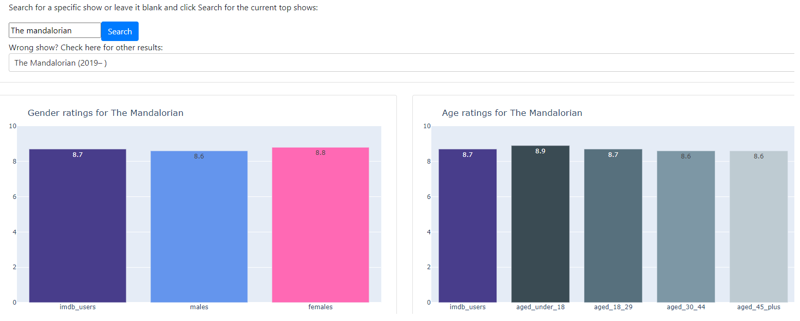

## IMDb Visualizer
IMDb Visualizer is an interactive dashboard for viewing IMDb tv show ratings broken down by Age and Gender.

Check out the web app on Heroku:

## Motivation
When looking for a new show to watch, we often check the ratings first on a site like IMDb. When deciding between
shows like Amish Mafia (3.1) or Chernobyl (9.4), the choice is clear. But when the stakes are high and the ratings are
close, a single value rating just doesn't cut it. In these cases, we can take a closer look at the ratings broken down 
by demographics such as age or gender.

Some shows skew heavily towards one demographic, like Sex & the City with a whopping 2.1 point difference between men 
and women. Or Beavis & Butt-Head with a 1 point difference in the other direction. And it seems like the older you get, 
the more you love shows like Downton Abbey while the teens just can't get enough of their Gossip Girl.
## Screenshots

## Built using
- [Plotly](https://plotly.com/)
- [Dash](https://plotly.com/dash/)
- [Dash Bootstrap Components](https://dash-bootstrap-components.opensource.faculty.ai/)

## Credits
- IMDb- TV show data and ratings